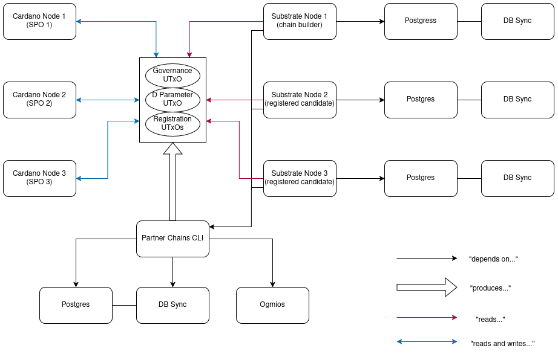

# Architecture

## System Overview

A Substrate-based blockchain and utility tools for creating and managing sidechains that are capable of connecting to the Cardano network.

The connection between the Cardano and Substrate networks is established through a set of UTxOs that serve as the communication channel between them.

These UTxOs are created by the Partner Chains CLI from the SDK, and store important data for running the sidechain.

## UTxOs

### Governance UTxO

The Governance UTxO contains a script that authorizes various governance actions across the system, including:
- Modifying committee participant lists
- Adjusting the D parameter
- Managing other system UTxOs
- Implementing protocol upgrades

This script ensures that only authorized entities can make governance-level changes to the system.

### D Parameter UTxO

The D Parameter UTxO stores a critical system configuration: the quantity of committee candidates that can participate in the cross-chain validation process. This parameter directly influences the decentralization and security properties of the sidechain.

### Registration UTxOs

Registration UTxOs store the mapping between Cardano and Substrate keys for each registered candidate. These UTxOs contain:
- Cardano public keys
- Corresponding Substrate public keys
- Additional metadata required for cross-chain operations

When a validator wishes to participate in the committee, they must register both their Cardano and Substrate keys, which are then stored in these specialized UTxOs.

## Sidechain Lifecycle

1. The sidechain creator aka the **chain builder** initializes the governance system by creating the Governance UTxO, and then setting the D parameter.
2. Committee candidates register using the Partner Chains CLI, creating Registration UTxOs.
3. The active committee validates Substrate transactions using their registered keys.
